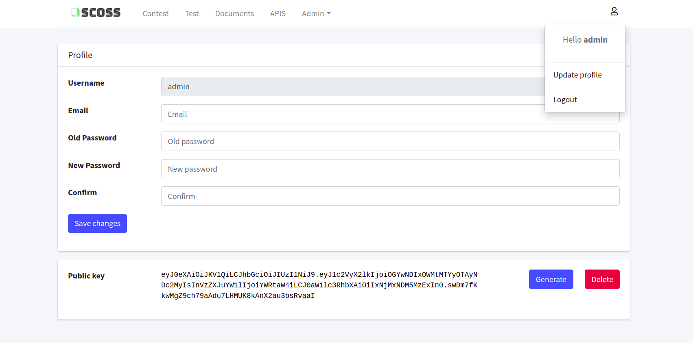

## API

### 1. Token sử dụng API
Người dùng hệ thống chọn mục Update profile > Generate để tạo token 

Sử dụng Delete để thu hồi lại token



### 2. Sử dụng API public


#### 1. API tạo project: `/api/project` method POST 
**Request**
Query Parameters

* public_token (string): token xác thực API

Body (from-data)

* project_name (string): Tên project 
Có thể sử dụng môt hoặc nhiều độ đo
* set_operator (float): Đặt ngưỡng cho độ đo trung lập set_operator. Giá trị nằm trong khoảng 0-1
* hash_operator (float): Đặt ngưỡng cho độ đo trung lập hash_operator. Giá trị nằm trong khoảng 0-1
* count_operator (float): Đặt ngưỡng cho độ đo trung lập count_operator. Giá trị nằm trong khoảng 0-1
* moss_score (float): Đặt ngưỡng cho độ đo trung lập moss_score. Giá trị nằm trong khoảng 0-1
* file: File zip chứa mã cần check trùng 
File zip có format như sau:
```sh
    Problem A/
    ├── a.cpp
    ├── b.py
    ├── c.java
    ├── ...

``` 
**Response**
Body

* project_id (string): Mã của project được tạo 
* url_result (string): Đường dẫn tới file kết quả check độ trùng lặp

#### 2 . APi lấy kết quả `/api/project/<project_id>` method GET 
**Request**
Query Parameters

* public_token (string): token xác thực API

**Response**

project_id: Mã project
project_name: Tên project
project_status: trạng thái project
results: Link kết quả kiểm tra độ trùng lặp

#### 3. APi lấy tất cả thông tin project `/api/project` method GET

**Request**
Query Parameters

* public_token (string): token xác thực API

**Response**
Danh sách các project được tạo bao gồm các thông tin:

* project_id (string): Mã project
* project_status (string): Trang thái project init (khởi tạo) - waiting (đợi)- running(đang chạy) - checked (đã kiểm tra xong) - failed (thất bại)
* project_name (string): Tên project
* sources (string): danh sách source code
* metrics (list): Danh sách các độ đo

#### 4. APi lấy thông tin chi tiết project `/api/project/<project_id>` method GET 

**Request**
Query Parameters

* public_token (string): token xác thực API

**Response**
Thông tin chi tiết project

* project_id (string): Mã project
* project_status (string): Trang thái project init (khởi tạo) - waiting (đợi)- running(đang chạy) - checked (đã kiểm tra xong) - failed (thất bại)
* project_name (string): Tên project
* sources (string): danh sách source code
* metrics (list): Danh sách các độ đo

#### 5. APi xóa project `/api/project/<project_id>` method DELETE  

**Request**
Query Parameters

* public_token (string): token xác thực API

**Response**

* success: True